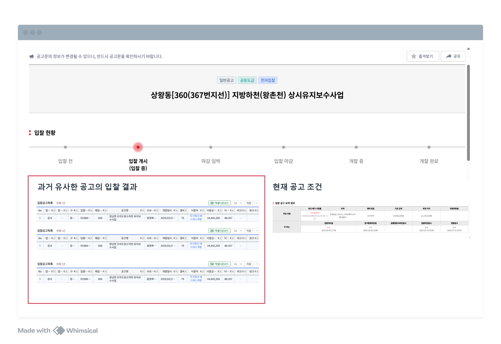

# 📝 **1. Hadoop 실습 회고록**
---

### 📌 **Hadoop 개념 정리**
- Hadoop은 **분산 저장과 병렬 처리를 위한 오픈소스 프레임워크**
- 대량의 데이터를 여러 서버에 분산하여 저장하고 처리할 수 있도록 설계

### **✅ Hadoop의 핵심 구성 요소**
| 구성 요소 | 역할 |
|----------|------|
| **HDFS (Hadoop Distributed File System)** | 분산 파일 시스템. 데이터를 블록 단위로 여러 노드에 저장 |
| **MapReduce** | 대규모 데이터 처리를 위한 병렬 컴퓨팅 프레임워크 |
| **YARN (Yet Another Resource Negotiator)** | 클러스터 리소스 관리 및 작업 스케줄링 담당 |
| **NameNode** | HDFS의 메타데이터(파일 정보, 블록 위치) 관리 |
| **DataNode** | 실제 데이터 블록 저장 및 관리 |
| **ResourceManager** | 클러스터 리소스를 관리하며 작업을 할당 |
| **NodeManager** | 개별 노드에서 실행되는 작업을 관리 |

---

## 🚀 **Hadoop 초기 설정 및 설치**
Hadoop을 처음 설치하면서 아래 단계를 진행했습니다.

### **✅ 1. 환경 변수 설정**
Hadoop이 정상 동작하려면 환경 변수를 설정해야 합니다.

```bash
# ~/.bashrc에 Hadoop 환경 변수 추가
export HADOOP_HOME=/usr/local/hadoop
export PATH=$PATH:$HADOOP_HOME/bin
export PATH=$PATH:$HADOOP_HOME/sbin
export HADOOP_CONF_DIR=$HADOOP_HOME/etc/hadoop
export JAVA_HOME=/usr/lib/jvm/java-8-openjdk-amd64
```

```bash
# 환경 변수 적용
source ~/.bashrc
```

---

### **✅ 2. SSH 설정**
Hadoop은 내부적으로 SSH를 사용하여 노드 간 통신을 합니다.  
SSH 설정이 제대로 되어 있어야 Hadoop이 원활하게 실행됩니다.

```bash
# SSH 키 생성
ssh-keygen -t rsa -P '' -f ~/.ssh/id_rsa

# SSH 키 추가 (비밀번호 없이 SSH 접속 가능하도록 설정)
cat ~/.ssh/id_rsa.pub >> ~/.ssh/authorized_keys

# 권한 설정
chmod 600 ~/.ssh/authorized_keys

# SSH 테스트 (비밀번호 입력 없이 접속되면 성공)
ssh localhost
```

---

### **✅ 3. Hadoop 실행**
```bash
# HDFS (NameNode, DataNode) 시작
start-dfs.sh

# YARN (ResourceManager, NodeManager) 시작
start-yarn.sh

# 실행된 프로세스 확인
jps
```

출력 예시:
```
NameNode
DataNode
SecondaryNameNode
ResourceManager
NodeManager
```

---

## 🔥 **직면한 문제와 해결 방법**
Hadoop을 실행하는 과정에서 여러 가지 **에러**를 경험했습니다.  
아래는 주요한 문제들과 해결 과정입니다.

---

### **⚠️ 1. Safe Mode 문제**
#### **에러 메시지**
```bash
mkdir: Cannot create directory /user. Name node is in safe mode.
```
#### **원인**
- Safe Mode는 NameNode가 **HDFS의 블록 복제 상태를 확인하는 동안 읽기 전용 모드가 되는 기능**입니다.
- 보통 HDFS가 새로 시작되었거나, DataNode가 충분하지 않을 때 발생합니다.

#### **해결 방법**
```bash
# Safe Mode 상태 확인
hdfs dfsadmin -safemode get

# Safe Mode 강제 해제
hdfs dfsadmin -safemode leave
```

---

### **⚠️ 2. NameNode가 실행되지 않는 문제**
#### **에러 메시지**
```bash
Call From localhost to localhost:9000 failed on connection exception: 
java.net.ConnectException: 연결이 거부됨
```
#### **원인**
- `NameNode`가 실행되지 않아서 `start-dfs.sh` 실행 후에도 정상적으로 작동하지 않음.

#### **해결 방법**
```bash
# NameNode 수동 실행
hdfs --daemon start namenode

# 실행 확인
jps
```

---

### **⚠️ 3. DataNode가 실행되지 않는 문제**
#### **에러 메시지**
```bash
WARN org.apache.hadoop.hdfs.server.datanode.fsdataset.impl.FsDatasetImpl: 
Failed to write dfsUsed to /home/hadoop/tmp/dfs/data/current
```
#### **원인**
- DataNode의 저장 디렉토리(`dfs.datanode.data.dir`)가 존재하지 않거나 권한이 없어서 실행되지 않음.

#### **해결 방법**
```bash
# 저장소 디렉토리 확인 및 권한 수정
sudo mkdir -p /home/hadoop/hadoop-3.2.2/tmp/dfs/data
sudo chown -R hadoop:hadoop /home/hadoop/hadoop-3.2.2/tmp/dfs/data

# DataNode 다시 시작
hdfs --daemon start datanode
```

---

### **⚠️ 4. 포트 충돌 문제**
#### **에러 메시지**
```bash
java.net.BindException: Port 50010 is already in use
```
#### **원인**
- 기존에 실행된 Hadoop 프로세스가 제대로 종료되지 않았거나, 다른 프로세스가 동일한 포트를 사용 중.

#### **해결 방법**
```bash
# 50010 포트를 사용하는 프로세스 찾기
netstat -tulnp | grep 50010

# 해당 프로세스를 강제 종료
sudo kill -9 <PID>

# Hadoop 다시 시작
stop-dfs.sh
start-dfs.sh
```

---

## 🔄 **터미널 재시작 후 해야 할 설정**
VM을 껐다 켜거나 터미널을 새로 열면 Hadoop이 자동으로 실행되지 않습니다.  
따라서 **아래 과정을 실행해야 합니다.**

```bash
# 1️⃣ 환경 변수 다시 로드
source ~/.bashrc

# 2️⃣ Hadoop 데몬 다시 실행
start-dfs.sh
start-yarn.sh

# 3️⃣ 실행된 프로세스 확인
jps

# 4️⃣ HDFS 정상 작동 확인
hdfs dfsadmin -report
```

---

## 🎯 **최종 회고**
### **✅ 배운 점**
- Hadoop의 핵심 개념(NameNode, DataNode, Safe Mode, 포트 설정 등)을 이해하게 됨.
- SSH 설정이 Hadoop 실행에 필수적이라는 점을 알게 됨.
- DataNode가 제대로 실행되지 않으면 Safe Mode가 해제되지 않는다는 점을 경험함.

### **❗ 개선할 점**
- 환경 설정을 더 자동화하여 터미널을 다시 열어도 실행되도록 스크립트를 작성할 필요가 있음.
- DataNode 저장소 및 로그를 주기적으로 확인하는 습관을 들여야 함.
- Safe Mode 관련 문제를 빠르게 해결할 수 있도록 절차를 익혀야 함.

### **🚀 다음 목표**
- YARN을 활용한 분산 작업 실행 연습
- MapReduce 프로그램을 작성하여 실제로 데이터 처리 실습 진행
- Hadoop 클러스터 환경에서 여러 노드 설정하여 실습

---

## 📌 **Hadoop을 다시 실행할 때 필수 체크리스트**
```bash
source ~/.bashrc        # 환경 변수 적용
start-dfs.sh            # HDFS 실행
start-yarn.sh           # YARN 실행
jps                     # 실행된 프로세스 확인
hdfs dfsadmin -report   # HDFS 정상 작동 확인
```

---
# 🏢 2. 기획안(나의 발제 아이디어 목록 및 최종 채택)

## 📌 개요
본 문서는 **나라장터 입찰정보 빅데이터 플랫폼 구축 기획안**을 최종적으로 채택하기까지의 과정과 기존 기획안을 정리

---

## 🛠 기존 기획 후보 분석

### **1️⃣ 키워드 기반 기업 & 산업 분석 레포트 제작 서비스**
#### **📍 기획 배경**
- 취업 준비생, 연구원, 투자자들이 특정 산업 및 기업 분석을 위해 직접 자료(논문, 뉴스, 산업 보고서)를 검색하고 정리하는 데 많은 시간이 소요됨.
- 기존 보고서 자동화 서비스는 기업 내부 데이터를 활용한 방식이라 외부 산업 트렌드를 반영하기 어려움.
- **Hadoop + 맵리듀스를 활용한 대규모 데이터 분석**을 통해 보다 신뢰성 있는 산업 분석 제공.

#### **📍 주요 기능**
1. **키워드 기반 자동 크롤링 및 분석**
   - 논문, 뉴스, 산업 보고서를 자동 수집하여 빅데이터 분석 진행
   - 선택한 데이터 범위(논문만, 논문+뉴스, 블로그 포함 등) 맞춤형 분석 가능
2. **XAI(설명 가능한 AI) 적용**
   - 데이터 출처와 분석 과정을 명확히 설명하여 신뢰도 보장
3. **Hadoop + Spark 기반 대량 데이터 처리**
   - 대규모 데이터를 빠르게 분석하여 키워드 트렌드 도출
4. **산업 트렌드 보고서 자동 생성**
   - 기업별, 산업별 트렌드 분석을 제공하여 취업 및 투자 판단 지원

#### **📍 사용 기술 스택**
- **Hadoop, Spark, HDFS, MapReduce**: 대량 데이터 수집 및 분석
- **TF-IDF, Word2Vec, BERT**: 키워드 추출 및 자연어 처리(NLP)
- **XAI 기반 데이터 신뢰성 분석**

#### **📍 한계점**
- 단순 트렌드 분석 이상의 기능을 제공하기 어렵고, 실시간 데이터 분석에 대한 고려가 부족함.

---

### **2️⃣ AI 기반 채용 추천 시스템**
#### **📍 기획 배경**
- 채용 담당관이 많은 자기소개서와 포트폴리오를 평가하는 데 어려움을 겪음.
- 기존 검색 방식은 키워드 기반으로 제한적이며, 지원자의 역량과 채용 조건의 연관성을 효과적으로 분석하지 못함.
- AI를 활용하여 **자연어 검색 기반의 지원자 추천 시스템 구축**을 목표로 함.

#### **📍 주요 기능**
1. **지원자 데이터 수집 및 분석**
   - 공개된 자기소개서, 포트폴리오, GitHub, Kaggle 데이터 크롤링
   - Word2Vec 기반 키워드 관계 분석 및 FAISS/Pinecone을 활용한 벡터 검색
2. **자연어 기반 채용 검색 엔진**
   - 채용 담당관이 구어체로 검색하면 AI가 적절한 지원자 추천
3. **FAISS + Elasticsearch 기반 실시간 검색 최적화**
   - NLP 분석 후 빠른 데이터 검색 및 추천 제공
4. **Llama 3 기반 AI 챗봇 활용**
   - 채용 담당관과 실시간 질의응답을 통해 최적의 지원자 추천

#### **📍 사용 기술 스택**
- **Hadoop HDFS, Spark ML, FAISS**: 데이터 저장 및 분산 처리
- **Elasticsearch, BM25**: 검색 최적화
- **Word2Vec, BERT, RAG 모델**: NLP 기반 추천 시스템 구축

#### **📍 한계점**
- 개인정보 보호로 오픈 자기소개서를 크롤링하기 힘듦.

---

## 🏆 **최종 채택: 나라장터 입찰정보 빅데이터 플랫폼**


### **📌 기획 배경**
- 정부 및 공공기관의 다양한 입찰 공고가 지속적으로 발생하지만, 효과적으로 분석하고 활용하는 시스템이 부족함.
- 기업들은 수많은 입찰 공고 중 **자사에 적합한 공고를 찾기 어렵고, 경쟁사의 입찰 동향을 파악하기 어려운 실정**.
- **빅데이터 및 AI 기술을 활용하여 입찰 공고의 검색과 추천을 자동화함으로써, 기업의 효율적인 입찰 참여를 지원**하는 것이 목표.

### **📌 주요 기능**
1. **입찰 공고 분산 저장**
   - 나라장터 API를 활용하여 실시간 또는 일정 주기로 입찰 공고 데이터를 수집
   - 대량 데이터를 처리하기 위해 **Hadoop HDFS 기반 분산 저장** 활용
2. **입찰 공고 검색 및 추천**
   - 키워드 기반 검색 및 필터링(지역, 금액, 업종 등)
   - 자연어 처리(NLP) 기반 공고 유사도 분석 및 추천
3. **낙찰 기업 데이터 분석 및 제공**
   - 공고별 낙찰 기업 정보 수집 및 시각화
   - 경쟁 기업의 입찰 동향 분석 제공

### **📌 사용 기술 스택**
- **Hadoop HDFS, MapReduce**: 대량 입찰 공고 데이터 수집 및 저장
- **Elasticsearch, NLP 모델**: 공고 검색 및 유사도 분석
- **Spark ML, TF-IDF, BERT**: 공고 추천 및 기업 분석

### **📌 기대 효과**
1. **기업 효과**
   - 빠르고 정확한 입찰 공고 검색으로 **업무 효율성 향상**
   - 유사 입찰 공고 추천을 통해 **신규 비즈니스 기회 확보**
   - 경쟁사의 낙찰 정보를 분석하여 **효과적인 입찰 전략 수립 가능**

2. **사용자 효과**
   - 중소기업 및 신생 기업이 **입찰 정보를 쉽게 탐색하고 참여 가능**
   - **데이터 기반 맞춤형 입찰 정보 제공**으로 기업 경쟁력 강화
   - 빅데이터를 활용한 공정한 경쟁 환경 조성

---

## 🎯 **결론 및 최종 채택 이유**

### ✅ **나라장터 입찰정보 빅데이터 플랫폼이 최종 채택된 이유**
1. **데이터의 신뢰성과 활용 가치가 높음**
   - 공공 데이터 활용으로 **정확한 데이터 확보 가능**.
   - 기존 기획안보다 **실제 기업들의 입찰 활동에 직접적인 도움을 줄 수 있음**.
2. **하둡을 활용한 빅데이터 분석의 적합성**
   - 지속적으로 증가하는 입찰 데이터를 **효율적으로 저장하고 분석할 필요성이 높음**.
   - Hadoop 기반으로 **대규모 데이터를 분산 저장 및 처리할 수 있어 확장성이 뛰어남**.
3. **공공·민간 협업 가능성**
   - 기업, 정부 기관과 협력하여 서비스 확장이 가능.
   - AI 기반 입찰 공고 추천 및 낙찰 기업 분석 기능 추가 시 **정부 지원 사업으로 연계 가능**.

따라서, 기존의 기획안들을 종합적으로 고려한 결과, **나라장터 입찰정보 빅데이터 플랫폼이 가장 적합한 방향**으로 판단되어 최종적으로 채택
